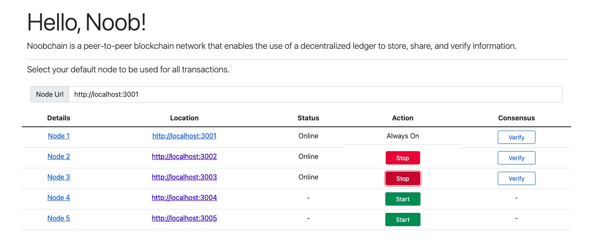

# Noobchain

<p align="center">
  <a ></a></p>
</p>

## About The Project

Implemented a blockchain architecture complete with nodes, wallet, faucet, miner & block explorer.

## What I learned

Where do I start! This was a great project. I was able to implement all my knowledge into one application. Understanding how data flows to and from the blockchain
was incredibly informative. Every aspect of this project helped to further solidify my blockchain knowledge.

## Installation

**You will be up and running in 2 simple steps**

```sh
// Step 1
npm install -g nodemon (Mac users prefix w/ sudo)

// Step 2
npm run noobchain
```

---

### Languages

- [JavaScript](https://www.javascript.com/)

### Built With

- [Next.js](https://nextjs.org/)
- [Bootstrap](https://getbootstrap.com/)
- [React Bootstrap](https://react-bootstrap.github.io/)
- [Recoil](https://yarnpkg.com/package/recoil)
- [Express](https://yarnpkg.com/package/express)

### Recommended Dependanices

- [Concurrently](https://yarnpkg.com/package/concurrently)
- [React Toastify](https://github.com/fkhadra/react-toastify#readme)
- [Crypto-js](https://yarnpkg.com/package/crypto-js)
- [Elliptic](https://yarnpkg.com/package/elliptic)
- [Request-Promise](https://yarnpkg.com/package/request-promise)

---

## Features

---

### 1. Wallet

<p align="center">
  <a ></a></p>
</p>

#### Functionality

- Wallet key & address derivation.
- Wallet transaction sign & send
- Secure inital seed derivation
- Check balances
- Use a private key to restore the wallet.

---

### 2. Faucet

<p align="center">
  <a ></a></p>
</p>

#### Functionality

- Coin request limit is set to 5,000 NOOBS
- Additional coins can be requested after a 90 second delay.
- Donate button lets you send coins back to the faucet
- The total balnce of the faucet is displayed at all times.

---

### 3. Block Explorer

<p align="center">
  <a ></a></p>
</p>

#### Functionality

- Displays home page with lastest blocks & transactions.
- Displays block information.
- Displays transaction information. (Pending & Confirmed).
- Displays transaction history of addresses.
- Search bar for quick access to information.

---

### 4. Nodes

<p align="center">
  <a ></a></p>
</p>

#### Functionality

- REST API.
- Validates Transactions.
- Multiple node synchronization.
- Block Validations.
- Mining Jobs

---

### 5. Miner

<p align="center">
  <a ></a></p>
</p>

#### Functionality

- Manual & automatic modes.
- Sync miner to their connected wallet.
- Only mines if pending transactions are present.

---

## Created By

- [Jason Schwarz | LinkedIn](https://www.linkedin.com/in/jason-schwarz-75b91482/)
